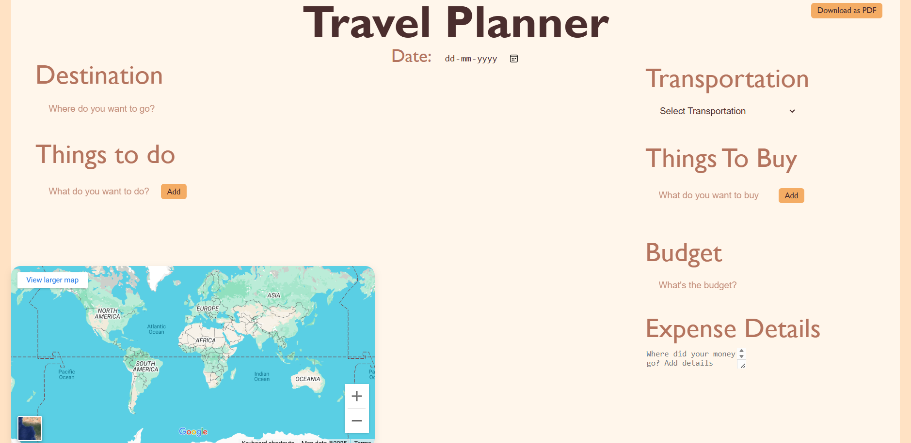
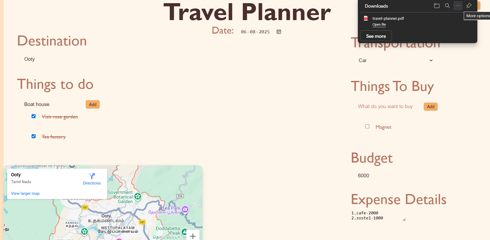

# Travel Planner

**Travel Planner** A beautifully designed, interactive Travel Planner built using React and CSS, made to help users plan their trips efficiently with features like destination tracking, budget estimation, to-do and shopping lists, transport modes, Google Maps integration, and PDF export.


---

## Features

### Trip Date Selector
- Select the date of your travel using a user-friendly date input field.

### Destination Input with Google Maps Integration
- Enter a destination and view the location directly on an embedded Google Map.
- The map automatically updates based on the typed destination.

### Things to Do & Things to Buy Lists
- Add new items to your travel checklist.
- Click on an item to mark it as completed.
- Double-click an item to remove it from the list.
- Two separate sections provided for managing both “Things to Do” and “Things to Buy”.

### Mode of Transportation Selector
- Select your preferred mode of travel: Bike, Car, Flight, Train, etc.

### Budget Estimation & Expense Details
- Enter an estimated budget for your trip.
- Add notes or break down expected expenses using a multi-line text area.

### Export Planner to PDF
- Users can download their complete travel plan as a PDF.
- Implemented using `html2canvas` and `jsPDF`.


---


## Technologies Used

- **React JS**: For building the user interface and handling state with `useState`.
- **CSS**: For custom styling and layout design.
- **Google Maps Embed API**: For displaying maps based on destination input.
- **html2canvas** and **jsPDF**: For capturing the planner view and generating a downloadable PDF.


---


## How to Run the Project

```bash
# 1. Clone the repository
git clone https://github.com/your-username/travel-planner.git

# 2. Navigate to the project directory
cd travel-planner

# 3. Install project dependencies
npm install

# 4. Install additional required libraries
npm install html2canvas jspdf

# 5. Start the development server
npm start
```

---

## Screenshots

### Homepage


### Filled Travel Plan + PDF Export in Action


